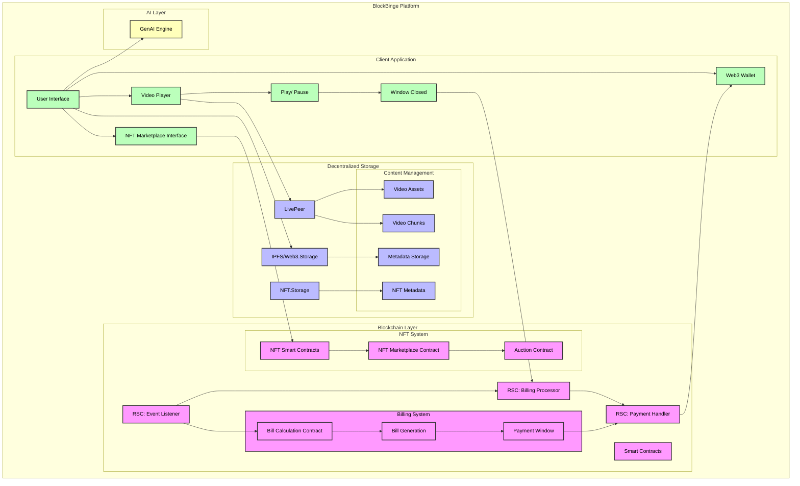
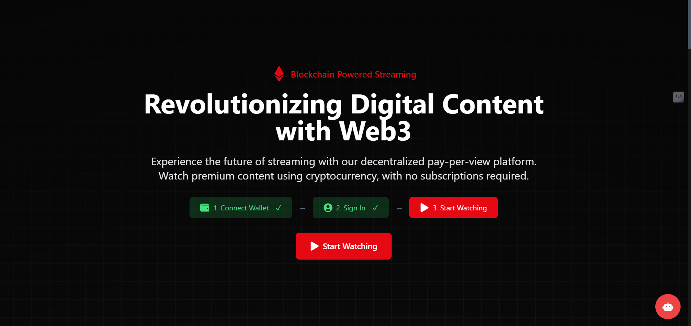
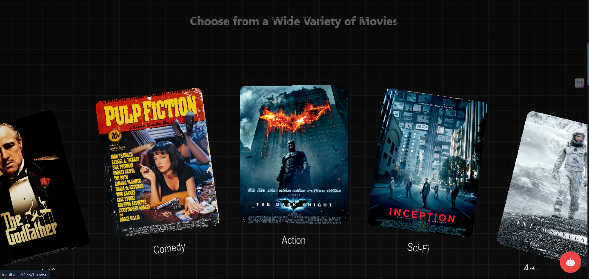
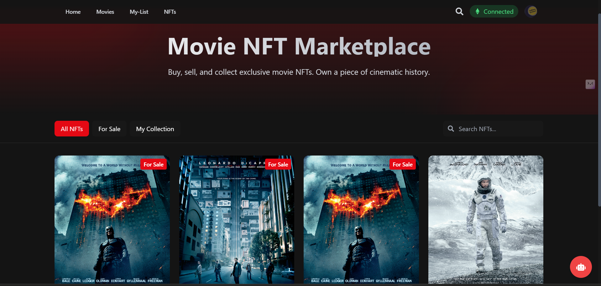
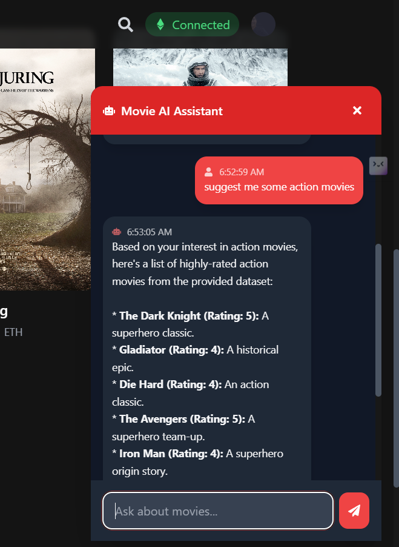

<div align="center">

# 🎬 BlockBinge - Decentralized Pay-Per-View Streaming Platform


> *Watch what you want, pay for what you watch. A revolutionary Web3 streaming platform powered by Reactive Smart Contracts.*

[](https://opensource.org/licenses/MIT)
[](https://soliditylang.org/)
[](https://dev.reactive.network)
[](https://blockbinge.vercel.app/)

[View Demo](https://blockbinge.vercel.app/) | [Smart Contracts](https://github.com/AbhigyaKrishna/block-binge-contracts) | [Frontend Code](https://github.com/vaibhavkothari33/BlockBinge)

</div>

A decentralized video streaming platform built with React, Web3, and Ethereum smart contracts. This platform allows users to stream content while paying through cryptocurrency, featuring a pay-as-you-watch model.


## 🌟 Features

- **Web3 Integration**: Seamless connection with MetaMask wallet
- **Pay-per-minute Streaming**: Users pay only for the content they watch
- **Real-time Billing**: Automatic billing based on watch time
- **Content Management**: Browse, search, and manage video content
- **User Authentication**: Secure login with Web3 capabilities
- **Responsive Design**: Works on desktop and mobile devices
- **AI Chatbot**: Interactive support for users
- **Dynamic Pricing**: Smart contracts adjust video prices based on demand
- **Access Control via NFTs**: Exclusive content access for NFT holders
- **Decentralized Storage**: Videos are stored on IPFS for censorship resistance


## 🏗️ Architecture


## 🛠 Tech Stack

- **Frontend**: React.js with Vite
- **Styling**: Tailwind CSS
- **Blockchain**: Ethereum (Solidity Smart Contracts)
- **Web3**: ethers.js, Web3-React
- **Authentication**: Custom Web3 auth

## 👋 Prerequisites

Before you begin, ensure you have the following installed:
- Node.js (v14.0.0 or later)
- npm or yarn
- MetaMask browser extension
- Git

## 🚀 Getting Started

1. **Clone the repository**
```bash
git clone https://github.com/vaibhavkothari33/BlockBinge.git
cd BlockBinge
```

2. **Install dependencies**
```bash
npm install
# or
yarn install
```

3. **Set up environment variables**
Create a `.env` file in the root directory:
```env
VITE_CONTRACT_ADDRESS=your_contract_address
VITE_INFURA_ID=your_infura_id
VITE_CHAIN_ID=your_chain_id
```

4. **Start the development server**
```bash
npm run dev
# or
yarn dev
```

5. **Build for production**
```bash
npm run build
# or
yarn build
```

## 🏛 Project Structure

```
Directory structure:
└── vaibhavkothari33-blockbinge.git/
    ├── README.md
    ├── eslint.config.js
    ├── index.html
    ├── package.json
    ├── postcss.config.js
    ├── tailwind.config.js
    ├── vite.config.js
    ├── artifacts/
    │   └── contracts/
    │       ├── MovieNFT.sol/
    │       │   ├── MovieNFT.json
    │       │   └── contract.js
    │       └── StreamingPlatform.sol/
    │           └── StreamingPlatform.json
    ├── public/
    └── src/
        ├── App.css
        ├── App.jsx
        ├── index.css
        ├── main.jsx
        ├── components/
        │   ├── Browse.jsx
        │   ├── CircularGallery.jsx
        │   ├── ClickSpark.jsx
        │   ├── LandingPage.jsx
        │   ├── Loader.jsx
        │   ├── MovieCard.jsx
        │   ├── MovieSlug.jsx
        │   ├── Movies.jsx
        │   ├── MyList.jsx
        │   ├── Navbar.jsx
        │   ├── Profile.jsx
        │   ├── Search.jsx
        │   ├── SpotlightCard.jsx
        │   ├── Squares.jsx
        │   ├── VideoSlug.jsx
        │   ├── WalletConnect.jsx
        │   ├── Auth/
        │   │   ├── Auth.jsx
        │   │   └── ProtectedRoute.jsx
        │   ├── ChatBot/
        │   │   └── ChatBot.jsx
        │   ├── Marketplace/
        │   │   ├── Marketplace.jsx
        │   │   └── MovieCard.jsx
        │   ├── VideoPlayer/
        │   │   └── VideoPlayer.jsx
        │   └── api/
        │       └── langflow.js
        ├── config/
        │   ├── appwrite.config.js
        │   ├── auth0.config.js
        │   ├── firebase.config.js
        │   └── web3.config.js
        ├── context/
        │   └── WalletContext.jsx
        ├── contexts/
        │   ├── AuthContext.jsx
        │   ├── LoaderContext.jsx
        │   └── Web3Context.jsx
        ├── contracts/
        │   ├── MovieNFT.sol
        │   └── StreamingPlatform.sol
        ├── data/
        │   ├── movies.js
        │   ├── src.code-workspace
        │   └── videos.js
        ├── hooks/
        │   └── useMyList.js
        ├── lib/
        │   └── appwrite.js
        ├── styles/
        │   ├── plyr-theme.css
        │   └── videojs-theme.css
        └── utils/
            ├── LangflowClient.js
            ├── connectors.js
            ├── contract.js
            ├── contract1.js
            └── networks.js

```

## 🔒 Smart Contracts

The platform uses the following main smart contracts:
- `StreamingPlatform.sol`: Handles video streaming and payments
- `NFTMarketplace.sol`: Manages NFT trading functionality


### Contract Deployment

1. Install Hardhat and dependencies
```bash
npm install --save-dev hardhat @nomiclabs/hardhat-ethers ethers
```

2. Deploy contracts
```bash
npx hardhat run scripts/deploy.js --network <your-network>
```

## 🎮 Usage

1. Connect your MetaMask wallet
2. Browse available content
3. Click on a video to start streaming
4. Pay-per-minute charges will be calculated automatically
5. Final payment will be processed when closing the video

## 👥 Team

- Vaibhav Kothari - Full Stack Developer
- Abhigya Krishna - Blockchain Developer
- Shrijan Katiya - Blockchain Developer
- Navya Rathore - AI Developer

## 🙏 Acknowledgments

- Reactive network community
- Langflow for AI 








